# 🚀 MyApp - Full Stack Web Application

[](https://github.com/csenguyenminhphuc/Tranning_Devops_CICD_Test/actions/workflows/ci.yml)
[](https://github.com/csenguyenminhphuc/Tranning_Devops_CICD_Test/actions/workflows/cd.yml)
[](https://opensource.org/licenses/MIT)

> Modern full-stack web application with automated CI/CD pipeline using Docker, GitHub Actions, and DigitalOcean VPS deployment.

🌐 **Live Demo:** [https://your-domain.com](https://your-domain.com)

## 📋 Table of Contents

- [🏗️ Architecture](#️-architecture)
- [🛠️ Tech Stack](#️-tech-stack)
- [🚀 Quick Start](#-quick-start)
- [🐳 Docker Setup](#-docker-setup)
- [🔄 CI/CD Pipeline](#-cicd-pipeline)
- [🌐 Deployment](#-deployment)
- [📁 Project Structure](#-project-structure)
- [⚙️ Configuration](#️-configuration)
- [🔧 Development](#-development)
- [📊 Monitoring](#-monitoring)
- [🤝 Contributing](#-contributing)
- [📄 License](#-license)

## 🏗️ Architecture


## 🛠️ Tech Stack

### Frontend
- **React** - Modern UI library
- **Nginx** - Web server & reverse proxy
- **Docker** - Containerization

### Backend
- **Flask** - Python web framework
- **Gunicorn** - WSGI HTTP Server
- **psycopg2** - PostgreSQL adapter

### Database
- **PostgreSQL 16** - Relational database
- **Custom pg_hba.conf** - Security configuration

### DevOps & Infrastructure
- **Docker Compose** - Multi-container orchestration
- **GitHub Actions** - CI/CD automation
- **DigitalOcean** - VPS hosting
- **SSL/TLS** - Secure communications

## 🚀 Quick Start

### Prerequisites
- Docker & Docker Compose
- Git
- Node.js (for local development)
- Python 3.12+ (for local development)

### 1. Clone Repository
```bash
git clone https://github.com/csenguyenminhphuc/Tranning_Devops_CICD_Test.git
cd Tranning_Devops_CICD_Test
```

### 2. Environment Setup
```bash
# Copy environment template
cp .env.example .env

# Edit environment variables
nano .env
```

### 3. Start Application
```bash
# Start all services
docker compose up -d

# View logs
docker compose logs -f

# Check status
docker compose ps
```

### 4. Access Application
- **Frontend:** http://localhost
- **Backend API:** http://localhost/api
- **Database:** localhost:5432

## 🐳 Docker Setup

### Services Overview

| Service | Port | Description |
|---------|------|-------------|
| `frontend` | 80, 443 | Nginx + React app |
| `backend` | Unix Socket | Flask API server |
| `db` | 5432 | PostgreSQL database |

### Docker Architecture
- **Frontend & Backend:** Communicate via Unix socket (`/tmp/myapp.sock`)
- **Backend & Database:** TCP connection with authentication
- **Volumes:** Persistent database storage + shared socket

### Health Checks
```yaml
healthcheck:
  test: ["CMD-SHELL", "pg_isready -U ${DB_USER} -d ${DB_NAME}"]
  interval: 5s
  timeout: 5s
  retries: 5
```

## 🔄 CI/CD Pipeline

### Workflow Overview

```mermaid
graph LR
    A[Code Push] --> B[CI: Test & Build]
    B --> C{Tests Pass?}
    C -->|✅ Yes| D[CD: Deploy]
    C -->|❌ No| E[Fail & Notify]
    D --> F[VPS Deployment]
    F --> G[Health Check]
```



### CI Pipeline (`ci.yml`)
1. **Syntax Testing** - Python code validation
2. **Frontend Build** - React compilation test
3. **Docker Build** - Container image creation
4. **Integration Test** - Service startup verification

### CD Pipeline (`cd.yml`)
1. **SSH to VPS** - Secure remote access
2. **Code Sync** - Git pull latest changes
3. **Environment Setup** - Secure .env creation
4. **Service Deployment** - Docker Compose orchestration
5. **Health Verification** - Post-deployment checks

### Pipeline Triggers
- **CI:** Push to `main` branch or Pull Requests
- **CD:** Successful CI completion or manual trigger

## 🌐 Deployment

### Production Environment
- **Server:** DigitalOcean VPS (Ubuntu)
- **Domain:** your-domain.com
- **SSL:** Self-signed certificate
- **Process Manager:** Docker Compose

### GitHub Secrets Configuration
```bash
VPS_HOST=<your-vps-ip>
VPS_USER=<your-username>
VPS_SSH_KEY=<private-ssh-key>
DB_NAME=<database-name>
DB_USER=<database-user>
DB_PASSWORD=<secure-password>
```

### Manual Deployment
```bash
# SSH to VPS
ssh <username>@<your-vps-ip>

# Navigate to project
cd /opt/myapp

# Update and restart
git pull origin main
docker compose down
docker compose build --no-cache
docker compose up -d
```

## 📁 Project Structure

```
myapp/
├── 📁 .github/workflows/     # CI/CD pipelines
│   ├── ci.yml               # Continuous Integration
│   └── cd.yml               # Continuous Deployment
├── 📁 fe/                   # Frontend React app
│   ├── src/                 # React source code
│   ├── public/              # Static assets
│   ├── build/               # Production build
│   └── package.json         # Dependencies
├── 📁 static/               # Static files
├── 📁 images/               # Image assets
├── 📁 certs/                # SSL certificates
├── 🐳 docker-compose.yml    # Service orchestration
├── 🐳 Dockerfile.frontend   # Frontend container
├── 🐳 Dockerfile.backend    # Backend container
├── 🐳 Dockerfile.database   # Database container
├── 🐍 app.py                # Flask application
├── 🔧 requirements.txt      # Python dependencies
├── 🌐 nginx.conf            # Nginx configuration
├── 🔐 pg_hba.conf           # PostgreSQL auth config
├── 📝 .env                  # Environment variables
└── 📖 README.md             # This file
```

## ⚙️ Configuration

### Environment Variables
```bash
# Database Configuration
DB_NAME=your_database_name
DB_USER=your_db_user
DB_PASSWORD=your_secure_password
DB_HOST=db
DB_PORT=5432

# Application Settings
FLASK_ENV=production
FLASK_DEBUG=false
```

### Nginx Configuration
- Reverse proxy to Flask backend
- Static file serving
- SSL termination
- Security headers

### PostgreSQL Security
- Custom authentication rules
- Network access control
- User privilege management

## 🔧 Development

### Local Development Setup
```bash
# Install Python dependencies
pip install -r requirements.txt

# Install Node.js dependencies
cd fe && npm install

# Start development servers
npm start                    # Frontend (port 3000)
python app.py               # Backend (port 5000)
```

### Database Management
```bash
# Connect to database
docker compose exec db psql -U <db_user> -d <db_name>

# View database logs
docker compose logs db

# Backup database
docker compose exec db pg_dump -U <db_user> <db_name> > backup.sql
```

### Debugging
```bash
# View all service logs
docker compose logs -f

# Inspect specific service
docker compose exec backend bash
docker compose exec db bash

# Monitor resource usage
docker stats
```

## 📊 Monitoring

### Health Checks
- Database connectivity verification
- Container status monitoring
- Application response validation

### Logging
- Structured logging with Docker Compose
- Centralized log aggregation
- Error tracking and alerting

### Performance Metrics
- Container resource usage
- Database performance monitoring
- Application response times

## 🔒 Security

### Security Measures
- Environment variable isolation
- PostgreSQL authentication control
- SSL/TLS encryption
- GitHub Secrets management
- Docker container isolation

### Best Practices
- Regular security updates
- Principle of least privilege
- Secure communication channels
- Audit logging

## 🤝 Contributing

1. **Fork** the repository
2. **Create** a feature branch (`git checkout -b feature/amazing-feature`)
3. **Commit** your changes (`git commit -m 'Add amazing feature'`)
4. **Push** to the branch (`git push origin feature/amazing-feature`)
5. **Open** a Pull Request

### Development Guidelines
- Follow PEP 8 for Python code
- Use ESLint for JavaScript code
- Write descriptive commit messages
- Add tests for new features
- Update documentation

## 📈 Roadmap

- [ ] Add automated testing suite
- [ ] Implement monitoring dashboard
- [ ] Add database migrations
- [ ] Setup production SSL certificates
- [ ] Add API documentation
- [ ] Implement user authentication
- [ ] Add performance optimization

## 📄 License

This project is licensed under the MIT License - see the [LICENSE](LICENSE) file for details.

## 👥 Authors

- **Phuc Nguyen** - *Initial work* - [@csenguyenminhphuc](https://github.com/csenguyenminhphuc)

## 🙏 Acknowledgments

- Docker team for containerization platform
- GitHub Actions for CI/CD automation
- DigitalOcean for VPS hosting
- Open source community

---

<div align="center">

**[🏠 Home](https://your-domain.com) • [📚 Documentation](./docs/) • [🐛 Issues](https://github.com/csenguyenminhphuc/Tranning_Devops_CICD_Test/issues) • [💬 Discussions](https://github.com/csenguyenminhphuc/Tranning_Devops_CICD_Test/discussions)**

Made with ❤️ by [Phuc Nguyen](https://github.com/csenguyenminhphuc)

</div>